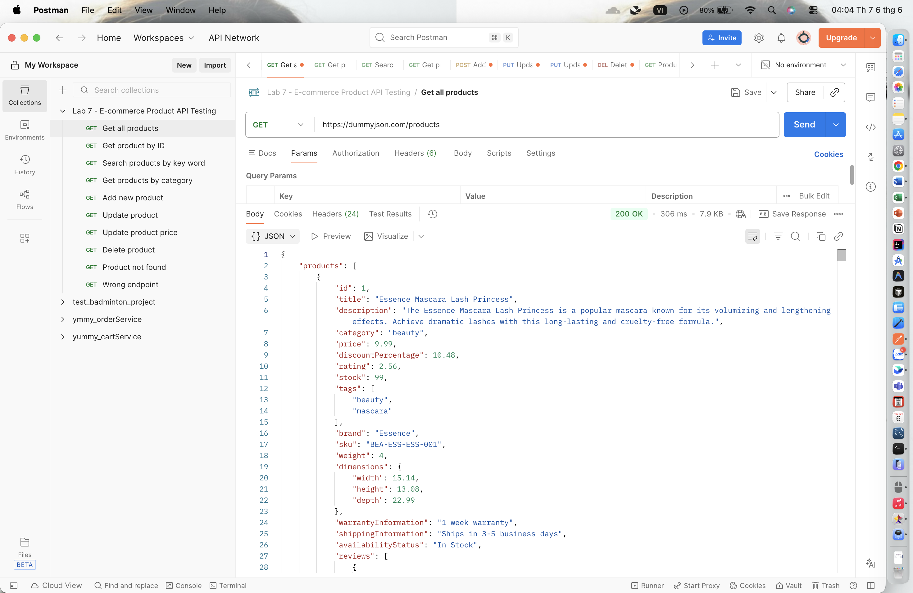
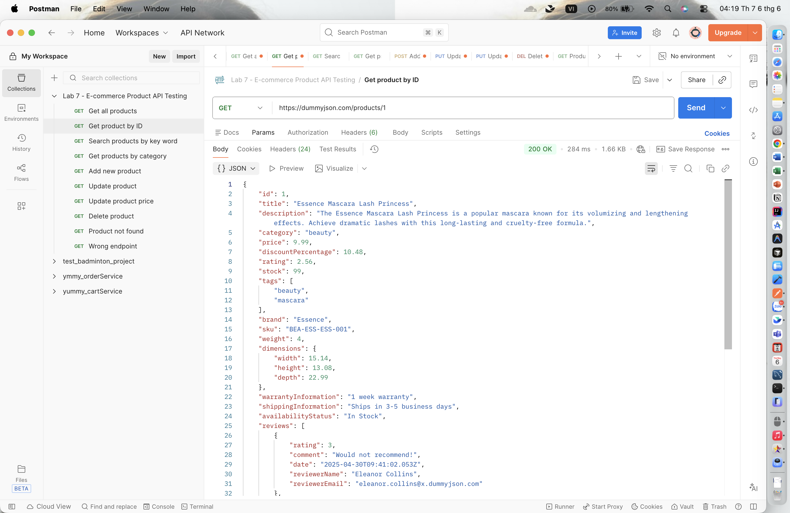
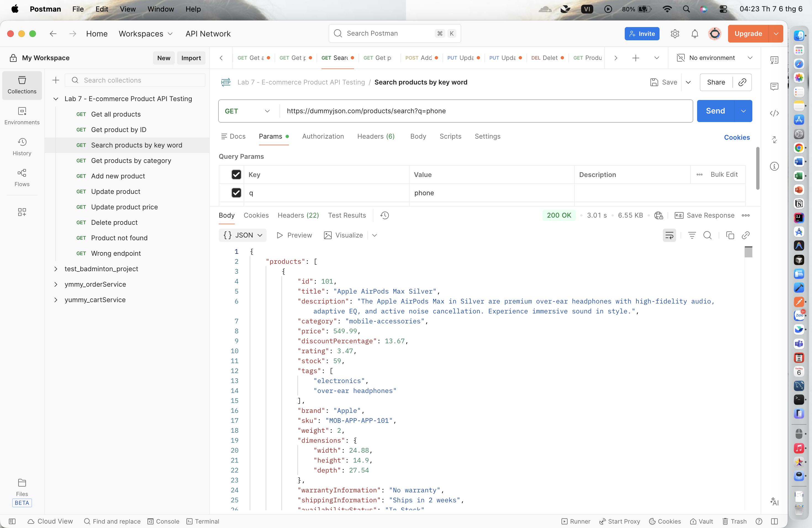
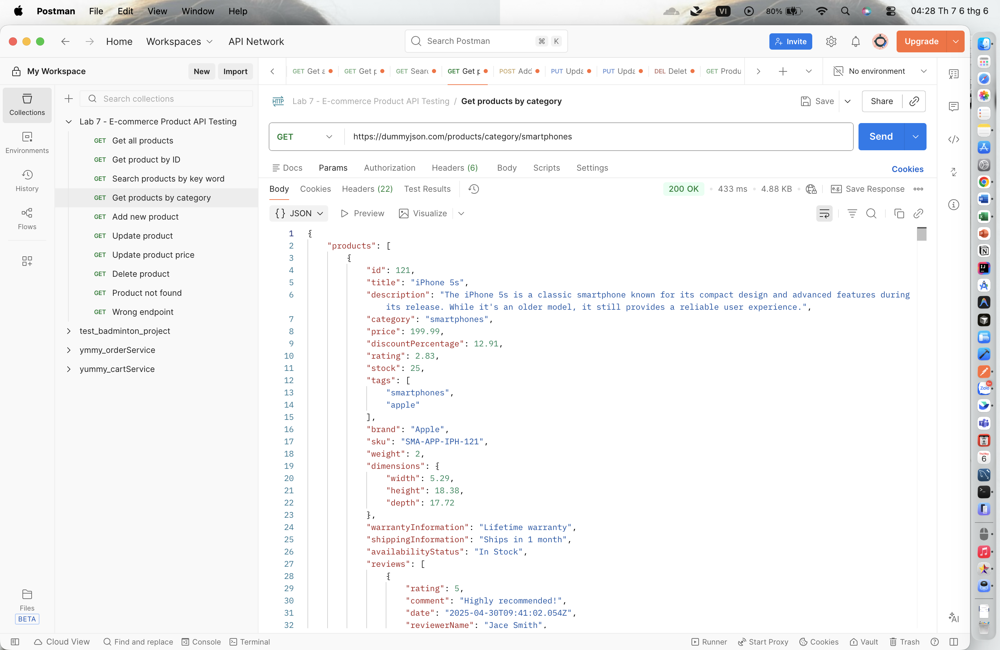
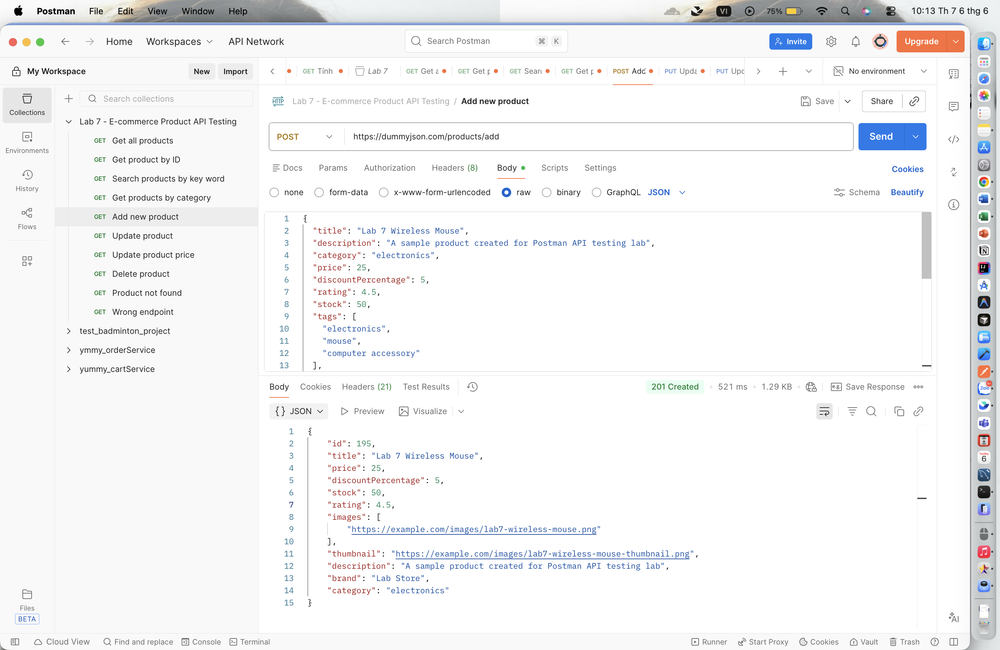
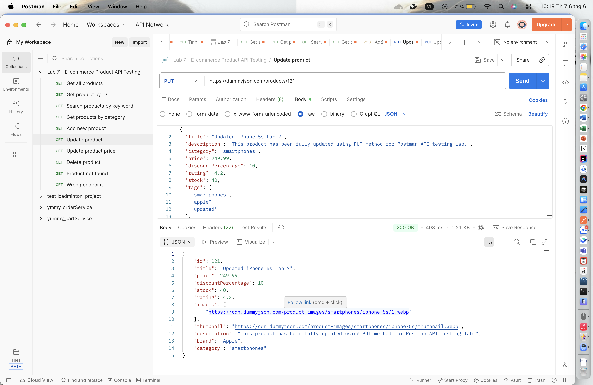
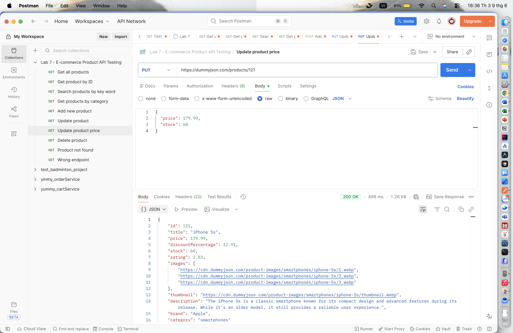
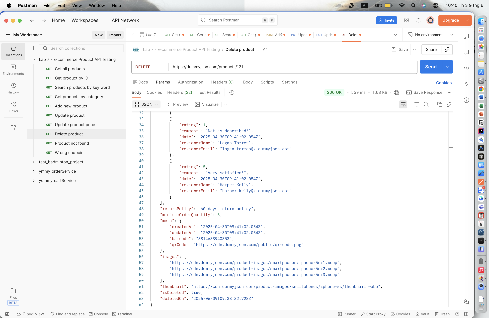
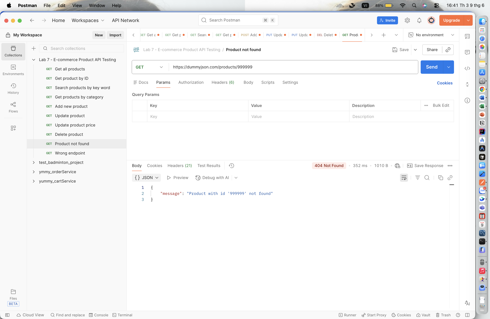
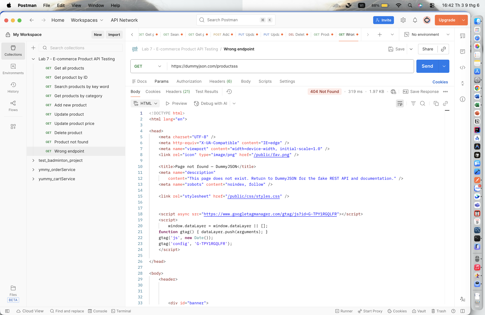

# Lab 7 - API Testing with Postman
## Dự án: Kiểm thử API quản lý sản phẩm trong hệ thống thương mại điện tử


### 1. Giới thiệu
Bài lab này được thực hiện nhằm tìm hiểu và áp dụng quy trình kiểm thử API bằng công cụ Postman. Nội dung chính của bài lab tập trung vào việc xây dựng, gửi yêu cầu và kiểm tra phản hồi của các API liên quan đến chức năng quản lý sản phẩm trong một hệ thống thương mại điện tử.

Trong quá trình thực hiện, bài lab sử dụng API mẫu được cung cấp bởi DummyJSON. Đây là một REST API giả lập, cung cấp dữ liệu JSON mẫu phục vụ cho mục đích học tập, phát triển giao diện, kiểm thử phần mềm và xây dựng prototype. DummyJSON được lựa chọn vì có cấu trúc dữ liệu rõ ràng, dễ sử dụng, không yêu cầu xác thực phức tạp và hỗ trợ nhiều nhóm endpoint phổ biến như sản phẩm, người dùng, giỏ hàng, bài viết và bình luận.

Việc sử dụng DummyJSON giúp quá trình kiểm thử API diễn ra thuận lợi, đồng thời tạo điều kiện để người thực hiện làm quen với các thao tác kiểm thử cơ bản trong Postman như gửi request, kiểm tra status code, phân tích response body và đánh giá tính đúng đắn của dữ liệu trả về.

### 2. Mục tiêu
**2.1. Mục tiêu kiến thức và kỹ năng**

Bài lab giúp sinh viên làm quen với quy trình kiểm thử API bằng công cụ Postman, đồng thời hiểu được vai trò của API trong quá trình trao đổi dữ liệu giữa client và server. Thông qua bài lab, sinh viên có thể nắm được các thành phần cơ bản của một request như URL, HTTP method, header, body và các thông tin phản hồi từ server như status code, response body và thời gian phản hồi.

Bên cạnh đó, sinh viên được rèn luyện kỹ năng sử dụng Postman để tạo Collection, quản lý các request theo nhóm chức năng, gửi request với các HTTP method phổ biến như GET, POST, PUT, PATCH và DELETE, cũng như truyền dữ liệu JSON trong phần Body của request. Đây là những kỹ năng cơ bản cần thiết trong quá trình kiểm thử API và phát triển phần mềm.

**2.2. Mục tiêu nội dung kiểm thử**

Bài lab tập trung kiểm thử các API liên quan đến chức năng quản lý sản phẩm trong hệ thống thương mại điện tử giả lập sử dụng DummyJSON API. Các chức năng được kiểm thử bao gồm lấy danh sách sản phẩm, xem thông tin chi tiết sản phẩm, thêm sản phẩm mới, cập nhật toàn bộ thông tin sản phẩm, cập nhật một phần thông tin sản phẩm và xóa sản phẩm.

Thông qua các request đã thực hiện, sinh viên tiến hành kiểm tra status code, phân tích response body và so sánh kết quả thực tế với kết quả mong đợi. Từ đó, sinh viên có thể đánh giá API có hoạt động đúng theo yêu cầu hay không, đồng thời biết cách ghi nhận kết quả kiểm thử, export Postman Collection và trình bày báo cáo bài lab trên GitHub một cách rõ ràng, có tổ chức.

### 3. Công cụ và API sử dụng
**3.1. Công cụ sử dụng**

Trong quá trình thực hiện bài lab, các công cụ được sử dụng nhằm hỗ trợ việc kiểm thử API, lưu trữ tài liệu và trình bày kết quả kiểm thử một cách rõ ràng.
| STT | Công cụ | Mục đích sử dụng | 
|-----|---------|-------------|
| 1 | Postman | Dùng để tạo Collection, gửi request đến API, kiểm tra response, status code và dữ liệu trả về từ server. | 
| 2 | GitHub | Dùng để lưu trữ mã nguồn, báo cáo bài lab, hình ảnh minh họa và file Postman Collection sau khi export. | 
| 3 | README.md | Dùng để trình bày nội dung báo cáo, mô tả quy trình thực hiện, danh sách API đã kiểm thử và kết quả kiểm thử. | 

**3.2. API sử dụng**

API được sử dụng trong bài lab là **DummyJSON**, một REST API giả lập cung cấp dữ liệu mẫu ở định dạng JSON. API này được dùng để thực hiện kiểm thử các chức năng liên quan đến quản lý sản phẩm trong hệ thống thương mại điện tử giả lập.

- Base URL: `https://dummyjson.com`
- Nhóm endpoint sử dụng: `/products`

Trong bài lab này, nhóm endpoint `/products` được sử dụng để thực hiện các thao tác kiểm thử cơ bản như lấy danh sách sản phẩm, xem chi tiết sản phẩm, thêm sản phẩm mới, cập nhật thông tin sản phẩm và xóa sản phẩm.

**3.3. Lý do lựa chọn DummyJSON**

DummyJSON được lựa chọn làm API kiểm thử trong bài lab vì có dữ liệu mẫu phù hợp với bài toán thương mại điện tử, đặc biệt là nhóm dữ liệu sản phẩm. API này miễn phí, dễ sử dụng, không yêu cầu đăng nhập phức tạp và trả về dữ liệu ở định dạng JSON rõ ràng, giúp quá trình quan sát và phân tích response thuận tiện hơn.

Ngoài ra, DummyJSON hỗ trợ nhiều thao tác API phổ biến như lấy danh sách, xem chi tiết, tìm kiếm, thêm, cập nhật và xóa sản phẩm. Vì vậy, API này phù hợp để sinh viên thực hành kiểm thử API bằng Postman, đồng thời giúp mô phỏng tương đối đầy đủ các thao tác thường gặp trong một hệ thống quản lý sản phẩm.

### 4. Mô tả dự án kiểm thử API
Dự án này mô phỏng quá trình kiểm thử API cho chức năng quản lý sản phẩm trong một hệ thống thương mại điện tử. Mục tiêu của phần kiểm thử là đánh giá khả năng hoạt động của các API liên quan đến sản phẩm, bao gồm việc truy xuất dữ liệu, tìm kiếm, lọc theo danh mục, thêm mới, cập nhật và xóa sản phẩm.

Đối tượng chính được kiểm thử trong dự án là Product. Đây là thực thể đại diện cho một sản phẩm trong hệ thống thương mại điện tử. Mỗi sản phẩm có thể bao gồm các thông tin cơ bản như mã sản phẩm, tên sản phẩm, mô tả, danh mục, giá bán, tỷ lệ giảm giá, đánh giá, số lượng tồn kho, thương hiệu và hình ảnh sản phẩm.

**4.1. Đối tượng kiểm thử**

| STT | Thuộc tính | Mô tả | 
|-----|---------|-------------|
| 1 | id | Mã định danh duy nhất của sản phẩm. | 
| 2 | title | Tên sản phẩm. | 
| 3 | description | Mô tả chi tiết về sản phẩm. | 
| 4 | category | Danh mục của sản phẩm. | 
| 5 | price | Giá bán của sản phẩm. | 
| 6 | discountPercentage | Phần trăm giảm giá của sản phẩm. | 
| 7 | rating | Điểm đánh giá trung bình của sản phẩm. | 
| 8 | stock | Số lượng sản phẩm còn trong kho. | 
| 9 | brand | Thương hiệu của sản phẩm. | 
| 10 | images | Danh sách hình ảnh minh họa của sản phẩm. | 

**4.2. Các chức năng được kiểm thử**

Trong dự án kiểm thử API này, các chức năng liên quan đến quản lý sản phẩm được thực hiện thông qua nhóm endpoint `/products` của DummyJSON API. Các chức năng được kiểm thử bao gồm:

| STT | Chức năng kiểm thử | Mô tả | 
|-----|---------|-------------|
| 1 | Lấy danh sách sản phẩm | Kiểm tra API trả về danh sách các sản phẩm trong hệ thống. | 
| 2 | Lấy chi tiết sản phẩm theo ID | Kiểm tra API trả về thông tin chi tiết của một sản phẩm cụ thể dựa trên id. | 
| 3 | Tìm kiếm sản phẩm theo từ khóa | Kiểm tra API tìm kiếm và trả về các sản phẩm phù hợp với từ khóa nhập vào. | 
| 4 | Lấy danh sách sản phẩm theo danh mục | Kiểm tra API lọc và trả về các sản phẩm thuộc một danh mục cụ thể. | 
| 5 | Thêm sản phẩm mới | Kiểm tra API tạo mới một sản phẩm với dữ liệu được gửi trong request body. | 
| 6 | Cập nhật toàn bộ thông tin sản phẩm | Kiểm tra API cập nhật đầy đủ thông tin của một sản phẩm đã tồn tại. | 
| 7 | Cập nhật một phần thông tin sản phẩm | Kiểm tra API cập nhật một số trường thông tin cụ thể của sản phẩm. | 
| 8 | Xóa sản phẩm | Kiểm tra API xóa một sản phẩm khỏi hệ thống dựa trên id. | 

### 5. Danh sách các Test case
| STT | Tên test case | Method | Endpoint | Kết quả mong đợi |
|-----|---------------|--------|----------|------------------|
| 1 | Lấy danh sách sản phẩm | GET | `/products` | Trả về danh sách sản phẩm, status `200 OK` |
| 2 | Lấy chi tiết sản phẩm theo ID | GET | `/products/1` | Trả về sản phẩm có `id = 1`, status `200 OK` |
| 3 | Tìm kiếm sản phẩm theo từ khoá | GET | `/products/search?q=phone` | Trả về danh sách sản phẩm phù hợp với từ khóa, status `200 OK` |
| 4 | Lấy danh sách sản phẩm theo danh mục | GET | `/products/category/smartphones` | Trả về danh sách sản phẩm thuộc danh mục smartphones, status `200 OK` |
| 5 | Thêm sản phẩm mới | POST | `/products/add` | Trả về dữ liệu sản phẩm vừa thêm |
| 6 | Cập nhật toàn bộ thông tin sản phẩm | PUT | `/products/1` | Trả về dữ liệu sản phẩm sau khi cập nhật |
| 7 | Cập nhật một phần thông tin sản phẩm | PATCH | `/products/1` | Trả về dữ liệu sản phẩm với trường đã được cập nhật |
| 8 | Xóa sản phẩm | DELETE | `/products/1` | Trả về thông tin sản phẩm đã xóa hoặc trạng thái xóa thành công |
| 9 | Lấy sản phẩm không tồn tại | GET | `/products/999999` | Trả về thông báo lỗi do sản phẩm không tồn tại |
| 10 | Gọi sai endpoint | GET | `/productssss` | Trả về thông báo lỗi do endpoint không hợp lệ |

### 6. Cấu trúc Collection trong Postman
**Collection được tạo với tên:**

`Lab 7 - E-commerce Product API Testing`

Collection này được sử dụng để lưu trữ toàn bộ các request kiểm thử API liên quan đến chức năng quản lý sản phẩm trong hệ thống thương mại điện tử. Việc sử dụng Collection giúp các request được tổ chức rõ ràng, dễ quản lý, dễ chạy lại khi cần kiểm thử và thuận tiện khi export để nộp kèm báo cáo.

Collection được xây dựng gồm các request sau:

| STT | Tên request | Method | URL | 
|-----|---------|--------|-----|
| 1 | Get all products | GET | `https://dummyjson.com/products` |
| 2 | Get product by ID | GET | `https://dummyjson.com/products/1` |
| 3 | Search products by key word | GET | `https://dummyjson.com/products/search?q=phone` |
| 4 | Get products by category | GET | `https://dummyjson.com/products/category/smartphones` |
| 5 | Add new product | POST | `https://dummyjson.com/products/add` |
| 6 | Update product | PUT | `https://dummyjson.com/products/1` |
| 7 | Update product price | PATCH | `https://dummyjson.com/products/1` |
| 8 | Delete product | DELETE | `https://dummyjson.com/products/1` |
| 9 | Product not found | GET | `https://dummyjson.com/products/999999` |
| 10 | Wrong endpoint | GET | `https://dummyjson.com/productsss` |

### 7. Nội dung kiểm thử chi tiết
**7.1. Lấy danh sách sản phẩm - Get all products**

**Method**: `GET`

**URL**: `https://dummyjson.com/products`

**Dữ liệu kiểm thử**: `Không truyền body. Request dùng để lấy toàn bộ danh sách sản phẩm từ API.`

**Mục đích:**

Request này dùng để lấy danh sách sản phẩm từ API. Đây là chức năng thường gặp trong hệ thống thương mại điện tử, ví dụ khi người dùng truy cập trang danh sách sản phẩm.

**Kết quả mong đợi:**

- Server trả về status code `200 OK`.
- Response body chứa danh sách sản phẩm.
- Mỗi sản phẩm có các thông tin như `id`, `title`, `description`, `category`, `price`, `rating`, `stock`...

**Kết quả thực tế:** API trả về danh sách sản phẩm thành công với status `200 OK`.



**7.2. Lấy chi tiết sản phẩm theo ID - Get product by ID**

**Method:** GET

**URL:** `https://dummyjson.com/products/1`

**Dữ liệu kiểm thử:** `productId = 1`

**Mục đích:**

Request này dùng để lấy thông tin chi tiết của một sản phẩm theo id. Đây là chức năng thường gặp trong hệ thống thương mại điện tử khi người dùng chọn một sản phẩm để xem thông tin chi tiết.

**Kết quả mong đợi:**

- Server trả về status code 200 OK.
- Response body là một object JSON.
- Dữ liệu trả về có id = 1.
- Sản phẩm có các thông tin chi tiết như `title`, `description`, `category`, `price`, `rating`, `stock`, `brand`,...

**Kết quả thực tế:** API trả về thông tin chi tiết của sản phẩm có `id = 1` với status `200 OK`.



**7.3. Tìm kiếm sản phẩm theo từ khóa - Search products by key word**

**Method:** GET

**URL:** `https://dummyjson.com/products/search?q=phone`

**Dữ liệu kiểm thử:** Từ khóa tìm kiếm: `phone`

**Mục đích:**

Request này dùng để kiểm thử chức năng tìm kiếm sản phẩm theo từ khóa. Trong hệ thống thương mại điện tử, chức năng tìm kiếm giúp người dùng nhanh chóng tìm được sản phẩm mong muốn.

**Kết quả mong đợi:**

- Server trả về status code `200 OK`.
- Response body chứa danh sách sản phẩm phù hợp với từ khóa `phone`.
- Các sản phẩm trả về có liên quan đến từ khóa tìm kiếm.
- Response body có cấu trúc gồm danh sách products, tổng số kết quả total, số lượng bỏ qua skip và giới hạn kết quả limit.

**Kết quả thực tế:** API trả về danh sách sản phẩm phù hợp với từ khóa tìm kiếm và status `200 OK`.



**7.4. Lọc sản phẩm theo danh mục - Get products by category**

**Method:** GET

**URL:** `https://dummyjson.com/products/category/smartphones`

**Dữ liệu kiểm thử:** `category = smartphones`

**Mục đích:**

Request này dùng để kiểm thử chức năng lọc sản phẩm theo danh mục. Đây là chức năng phổ biến trong website thương mại điện tử, giúp người dùng xem các sản phẩm thuộc một nhóm cụ thể.

**Kết quả mong đợi:**

- Server trả về status code `200 OK`.
- Response body chứa danh sách sản phẩm thuộc danh mục smartphones.
- Các sản phẩm trả về có trường category tương ứng với danh mục được yêu cầu.

**Kết quả thực tế:** API trả về danh sách sản phẩm thuộc danh mục smartphones với status 200 OK.



**7.5. Thêm sản phẩm mới - Add new product**

**Method:** POST

**URL:** `https://dummyjson.com/products/add`

**Headers:** Content-Type: `application/json`

**Dữ liệu kiểm thử:**

```javascript
{
  "title": "Lab 7 Wireless Mouse",
  "description": "A sample product created for Postman API testing lab",
  "category": "electronics",
  "price": 25,
  "discountPercentage": 5,
  "rating": 4.5,
  "stock": 50,
  "tags": [
    "electronics",
    "mouse",
    "computer accessory"
  ],
  "brand": "Lab Store",
  "sku": "LAB-MOUSE-001",
  "weight": 1,
  "dimensions": {
    "width": 12.5,
    "height": 4.5,
    "depth": 7.5
  },
  "warrantyInformation": "12 months warranty",
  "shippingInformation": "Ships in 3-5 business days",
  "availabilityStatus": "In Stock",
  "returnPolicy": "30 days return policy",
  "minimumOrderQuantity": 1,
  "images": [
    "https://example.com/images/lab7-wireless-mouse.png"
  ],
  "thumbnail": "https://example.com/images/lab7-wireless-mouse-thumbnail.png"
}
```

**Mục đích:**

Request này dùng để gửi dữ liệu sản phẩm mới lên server. Đây là chức năng thường được sử dụng trong trang quản trị của hệ thống thương mại điện tử khi nhân viên hoặc quản trị viên thêm sản phẩm mới vào hệ thống.

**Kết quả mong đợi:**

- Server xử lý request thành công.
- Response body chứa dữ liệu sản phẩm vừa được gửi lên.
- API trả về thêm trường id cho sản phẩm mới.
- Các trường như title, description, category, price, stock, brand, sku khớp với dữ liệu đã gửi.

**Kết quả thực tế:** API trả về dữ liệu sản phẩm mới sau khi gửi request thành công.



**7.6. Cập nhật toàn bộ thông tin sản phẩm - Update product**

**Method:** PUT

**URL:** `https://dummyjson.com/products/121`

**Headers:** Content-Type: `application/json`

**Dữ liệu kiểm thử:**

```javascript
{
  "title": "Updated iPhone 5s Lab 7",
  "description": "This product has been fully updated using PUT method for Postman API testing lab.",
  "category": "smartphones",
  "price": 249.99,
  "discountPercentage": 10,
  "rating": 4.2,
  "stock": 40,
  "tags": [
    "smartphones",
    "apple",
    "updated"
  ],
  "brand": "Apple",
  "sku": "SMA-APP-IPH-121-UPD",
  "weight": 2,
  "dimensions": {
    "width": 5.5,
    "height": 18.5,
    "depth": 17.8
  },
  "warrantyInformation": "1 year warranty",
  "shippingInformation": "Ships in 7 business days",
  "availabilityStatus": "In Stock",
  "returnPolicy": "30 days return policy",
  "minimumOrderQuantity": 2,
  "images": [
    "https://cdn.dummyjson.com/product-images/smartphones/iphone-5s/1.webp"
  ],
  "thumbnail": "https://cdn.dummyjson.com/product-images/smartphones/iphone-5s/thumbnail.webp"
}
```

**Mục đích:**

Request này dùng để cập nhật toàn bộ thông tin của sản phẩm có id = 121. Trong thực tế, chức năng này thường được dùng khi quản trị viên cần chỉnh sửa đầy đủ thông tin của một sản phẩm trong hệ thống.

**Kết quả mong đợi:**

- Server xử lý request thành công.
- Response body chứa dữ liệu sản phẩm sau khi cập nhật.
- Dữ liệu trả về có `id = 121`.
- Các trường như title, description, category, price, stock, brand, sku thay đổi theo dữ liệu đã gửi.

**Kết quả thực tế:** API trả về dữ liệu sản phẩm đã được cập nhật sau khi gửi request thành công.


**7.7. Cập nhật một phần thông tin sản phẩm - Update product price**

**Method:** PATCH

**URL:** `https://dummyjson.com/products/121`

**Headers:** Content-Type: `application/json`

**Dữ liệu kiểm thử:**

```javascript
{
  "price": 179.99,
  "stock": 60
}
```

**Mục đích:**

Request này dùng để cập nhật một phần thông tin của sản phẩm. Trong trường hợp này, em chỉ cập nhật trường price và stock. Đây là chức năng phù hợp khi quản trị viên chỉ cần sửa một số thông tin nhỏ của sản phẩm mà không cần gửi lại toàn bộ dữ liệu.

**Kết quả mong đợi:**

- Server xử lý request thành công.
- Response body chứa dữ liệu sản phẩm sau khi cập nhật.
- Dữ liệu trả về có id = 121.
- Trường price được thay đổi thành 179.99.
- Trường stock được thay đổi thành 60.

**Ví dụ response mong đợi:**

```javascript
{
  "id": 121,
  "title": "iPhone 5s",
  "price": 179.99,
  "stock": 60
}
```

**Kết quả thực tế:** API trả về dữ liệu sản phẩm với trường price và stock đã được cập nhật.


**7.8. Xóa sản phẩm - Delete product**

**Method:** DELETE

**URL:** `https://dummyjson.com/products/121`

**Dữ liệu kiểm thử:** `productId = 121`

**Mục đích:**

Request này dùng để gửi yêu cầu xóa sản phẩm có id = 121. Đây là chức năng thường gặp trong trang quản trị khi quản trị viên muốn xóa một sản phẩm khỏi hệ thống.

**Kết quả mong đợi:**

- Server xử lý yêu cầu xóa thành công.
- Response body trả về thông tin sản phẩm đã xóa hoặc trạng thái xóa.
- Dữ liệu trả về có id = 121.
- Response body có thể xuất hiện trường thể hiện sản phẩm đã bị xóa, ví dụ isDeleted.
- Response body có thể xuất hiện trường thời gian xóa, ví dụ deletedOn.

**Ví dụ response mong đợi:**

```javascript
{
  "id": 121,
  "title": "iPhone 5s",
  "isDeleted": true,
  "deletedOn": "2026-06-05T00:00:00.000Z"
}
```

**Kết quả thực tế:** API xử lý yêu cầu xóa sản phẩm thành công.


### 8. Kiểm thử trường hợp lỗi

Ngoài các request thành công, em thực hiện thêm một số request lỗi để quan sát cách API phản hồi khi dữ liệu hoặc đường dẫn không hợp lệ. Việc kiểm thử các trường hợp lỗi giúp đánh giá khả năng xử lý lỗi của API và giúp người kiểm thử hiểu rõ hơn về phản hồi của server trong những tình huống không hợp lệ.

**8.1. Lấy sản phẩm không tồn tại - Product not found**

**Method:** GET

**URL:** `https://dummyjson.com/products/999999`

**Dữ liệu kiểm thử:** `productId = 999999`

**Mục đích:**

Request này dùng để kiểm tra phản hồi của API khi client yêu cầu thông tin chi tiết của một sản phẩm không tồn tại trong hệ thống. Đây là một trường hợp kiểm thử lỗi thường gặp, giúp xác định API có trả về thông báo phù hợp khi tài nguyên không tồn tại hay không.

**Kết quả mong đợi:**

- Server không trả về dữ liệu sản phẩm hợp lệ.
- Response body trả về thông báo lỗi.
- Nội dung lỗi thể hiện rằng sản phẩm với id được yêu cầu không tồn tại hoặc không được tìm thấy.

**Ví dụ response mong đợi:**

```javascript
{
  "message": "Product with id '999999' not found"
}
```

**Kết quả thực tế:** API trả về thông báo lỗi cho biết sản phẩm có id = 999999 không tồn tại.


**8.2. Gọi sai endpoint - Wrong endpoint**

**Method:** GET

**URL:** `https://dummyjson.com/productsss`

**Dữ liệu kiểm thử:** Endpoint được nhập sai: `/productsss`

**Mục đích:**

Request này dùng để kiểm tra phản hồi của API khi client gọi sai endpoint. Đây là trường hợp kiểm thử lỗi nhằm quan sát cách server phản hồi khi đường dẫn API không hợp lệ hoặc tài nguyên được yêu cầu không tồn tại.

**Kết quả mong đợi:**

- Server không trả về danh sách sản phẩm hợp lệ.
- Response body trả về thông báo lỗi.
- Nội dung lỗi thể hiện rằng endpoint không tồn tại hoặc route không được tìm thấy.


**Kết quả thực tế:** API trả về thông báo lỗi do endpoint /productsss không hợp lệ.



### 9. Nhận xét kết quả kiểm thử

Qua quá trình kiểm thử, các request cơ bản đều được API xử lý thành công. Các request GET trả về dữ liệu sản phẩm đúng theo endpoint được gọi. Request tìm kiếm sản phẩm trả về danh sách sản phẩm phù hợp với từ khóa. Request lọc theo danh mục trả về các sản phẩm thuộc danh mục tương ứng.

Các request POST, PUT, PATCH và DELETE đều trả về phản hồi cho thấy server đã xử lý yêu cầu. Tuy nhiên, do DummyJSON là API giả lập nên các thao tác thêm, sửa và xóa không làm thay đổi dữ liệu thật trên server. API chỉ mô phỏng phản hồi như một hệ thống thật để phục vụ mục đích học tập và kiểm thử.

Các trường hợp lỗi giúp người kiểm thử quan sát được cách API phản hồi khi client gọi sai endpoint hoặc yêu cầu tài nguyên không tồn tại. Điều này giúp hiểu rằng kiểm thử API không chỉ kiểm tra trường hợp thành công mà còn cần kiểm tra cả trường hợp thất bại.

### 10. Kết luận

Thông qua bài lab này, em đã biết cách sử dụng Postman để kiểm thử API trong một bài toán gần với thực tế là quản lý sản phẩm của hệ thống thương mại điện tử. Em đã thực hành tạo Collection, tạo request, lựa chọn HTTP method, nhập URL, truyền dữ liệu JSON trong Body và đọc response trả về từ server.

Bài lab giúp em hiểu rõ hơn ý nghĩa của các HTTP method phổ biến như GET, POST, PUT, PATCH và DELETE. Ngoài ra, em cũng biết cách ghi lại kết quả kiểm thử, chụp ảnh minh họa, export Postman Collection và trình bày báo cáo trong file README.md trên GitHub.

### 11. Cấu trúc thư mục
```javascript
lab-7-postman-dummyjson/
│
├── README.md
├── Lab7_DummyJSON_Postman_Collection.json
│
└── images/
    ├── 01_get_all_products.png
    ├── 02_get_product_by_id.png
    ├── 03_search_products_by_key_word.png
    ├── 04_get_products_by_category.png
    ├── 05_add_new_product.png
    ├── 06_update_product.png
    ├── 07_update_product_price.png
    ├── 08_delete_product.png
    ├── 09_product_not_found.png
    └── 10_wrong_endpoint.png
```
